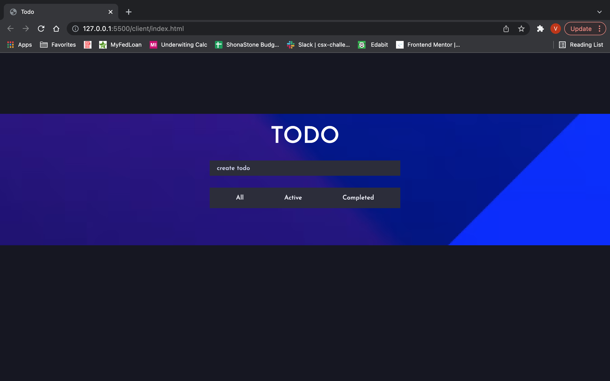
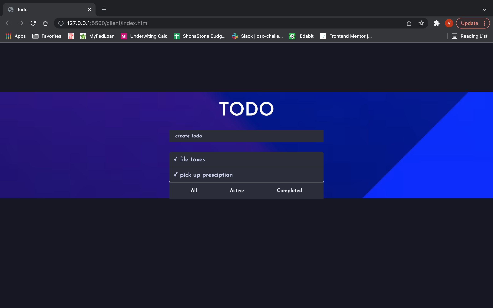

Project Description:

The Todo App is a user interactive web application that allows users to create and organize task lists. 
Users are able to create and organize items on their list, according to their needs.

Tech Stack:
html
css
javascript
node.js

